# Manual de Usuario
Bienvenido al manual de usuario de Dragonlandia. 

Antes de nada se debe ejecutar la aplicación.

## Creación del Escenario
   
### Bosque
  Crea el bosque donde se va a llevar a cabo la batalla introduciendo el nombre que deseas para el bosque y su nivel de peligro.

   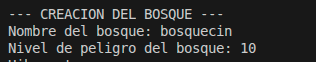

### Monstruos
 Ahora procederemos con la creacion de los monstruos que habitan el bosque y contra los que van a luchar los magos y el dragon.
 *  Se deben crear un mínimo de 3 monstruos con los campos de nombre, vida( cantidad de daño que pueden aumir antes de morir), fuerza(cantidad de daño que hace al atacar), y su tipo( spectro, ogro o troll). 
  
    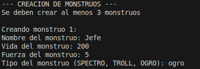
 *  Después de crear los 3 Monstruos obligatoris se tiene la opcion de seguir creando Monstruos. Si intruduce S se continua con la creacion de un nuevo monstruo y al terminar y vuelve a aparecer la opcion de crear uno nuevo.
  
    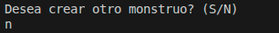
* Por último se debe asignar un monstruo jefe entre los creados para que sea el lider del bosque. Se mostraraon los monstruos creados cun un indice y hay que introducir el indice del monstruo deseado. **Durante la batalla si el monstruo jefe muere se asignara automaticamente un nuevo monstru jefe**, el bosque no puede estar sin un lider
  
    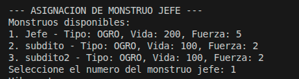

## Dragon
Despues de la creación de los monstruos a la asaignación del monstruo jefe se procedera con la creación del Dragón( solo habra 1). Para la creación del dragón se necesitaran los campos de su nombre, su resistencia ( cantidad de puntos de daño que puede recibir), y su Intesidad de fuego( daño de ataque).

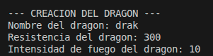

A la hora del combate **el dragón atacará automáticamente al monstruo jefe**

## Magos
Para terminar la creación del entorno para la batalla se procedera con la creación de los magos.
 *  Se deben crear un mínimo de 2 magos con los campos de nombre, vida( cantidad de daño que pueden aumir antes de morir), nivel de magia(cantidad de daño que hace al atacar, sin tener en cuenta las especificaciones de los hechizos), y los hechizos que conoce(se tienen que elegir un mínimo de 2 hechizo y un máximo de 4 entre **rayo, bola_de_nieve, bola_de_fuego y putrefaccion**  ), el mago usara los hechizos para atacar. 
  
    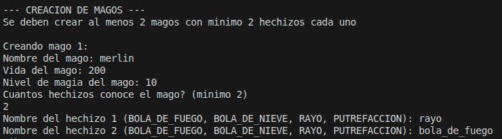
 *  Después de crear los 2 Magos obligatoris se tiene la opcion de seguir creando Magos. Si intruduce S se continua con la creacion de un nuevo Mago y al terminar y vuelve a aparecer la opcion de crear uno nuevo.
  
    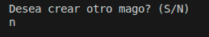

---

## Combate

Después de la creación del escenari se procedera de forma automática con el combate entre los monstrous/ magos y dragon. El combate esta en formato combate por turnos dividido en varias rondas. En cada ronda habrá un turno para los magos, para los monstruos y para el dragón. El combate termina cuando en uno de los bandos ( monstruos/ magos) todos sus miembros estan muertos ( tienen 0 de vida). 

### Turno de los magos
Es el único turno que controla el jugador, en el turno de los magos se le permite al jugador seleccionar el hechizo con el que va a atacar cada mago y el objetivo de dicho ataque. Se pueden selecionar hechizos que el mago no conoce, en este caso el mago perdera un punto de vida y no hara daño a ningún monstruo.

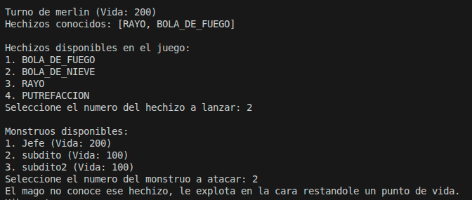

* Efectos hechizos:
1. **Bola_de_fuego**: La bola de fuego inflinge daño al objetivo con el valor del nivel de magia del mago + 5 puntos de daño.
2. **Bola_de_nieve**: La bola de nieve inflinge daño al objetivo con el valor de todos lus puntos de vida que tenga el objetivo ( lo mata directamente).
3. **Rayo**: El rayo inflinge daño al objetivo con el valor del nivel de magia del mago + 3 puntos de daño.
4. **Putrefacción**: La putrefacción inflinge daño al objetivo con el valor de 10 puntos de daño.

### Turno de los monstruos
El turno de los monstruos se gestiona de forma automática, cada monstrou ataca de forma aleatoria a un mago reduciendo la vida de este el valor de la fuerza del monstruo atacante. Una vez que atacen todos los monstruos se acaba su turno

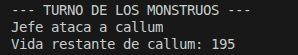

### Turno del Dragon
El turno de los dragones también se gestiona de forma automática, el dragón ataca de forma automática al que sea el jefe de los monstruos ( recordar de que en caso de que muera el monstru jefe y sigan más monstrous con vida se asignara un nuevo monstruo jefe de forma aleatoria) restándole a sus puntos de vida el valor de la intesidad de su fuego. Despues de que ataca el dragon el monstruo jefe le contraatacara en valor de su fuerza

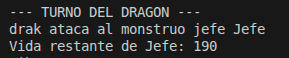

### Final de Ronda
Al final de cada ronda se mostrará el estado actual de la partida, dando lugar a una nueva ronda.

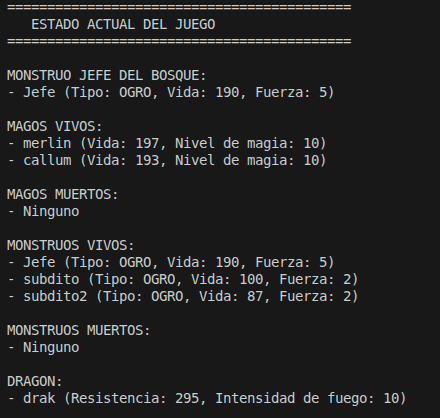

### Final del Juego
Una vez que un bando haya ganado se mostrara por pantalla el bando ganador y la información de como quedo la partida.

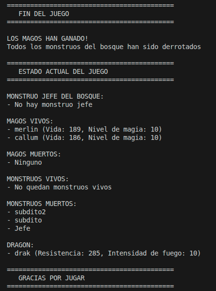

   