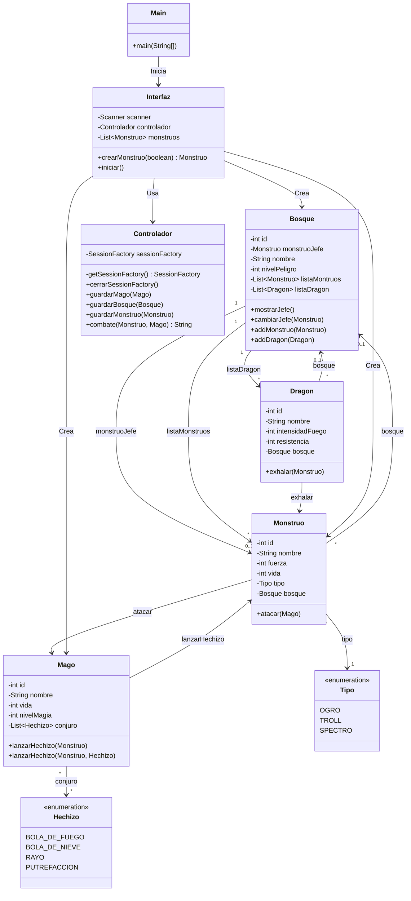
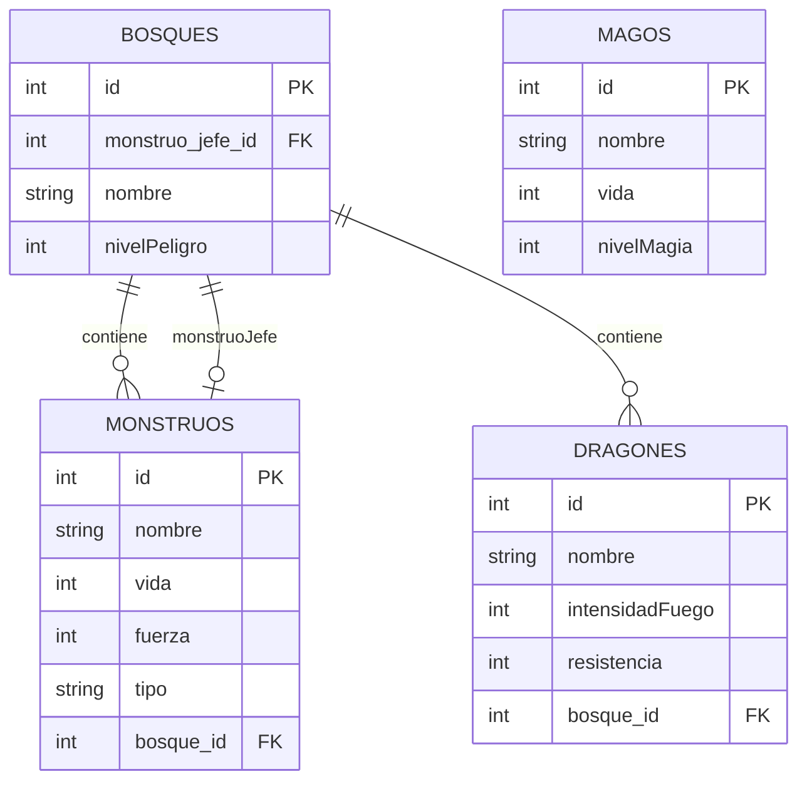

# Dragonlandia

## Descripcion
En este proyecto vamos a implementar una aplicación que va a gestionar combates entre diferentes clases que representan a personjes fantasticos con persistencia de datos en una base de datos. En la rama main no estan implementados los dragones

## Análisis

### Diagrama clases

## Diseño

### Diagrama entidad relación

